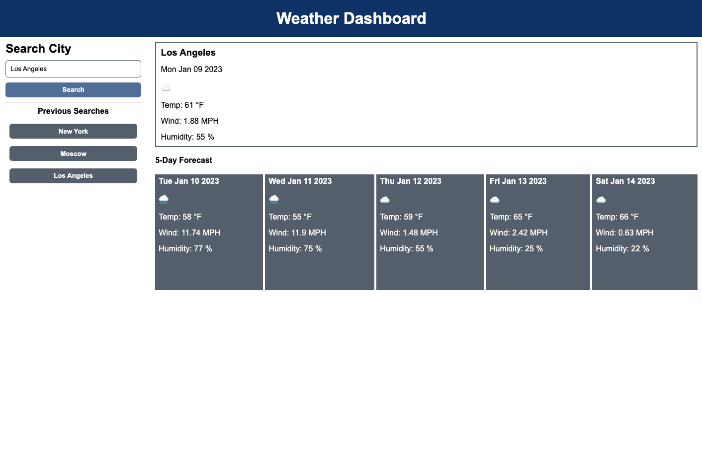

# Weather Forecast App
## Project Scope

This weather dashboard application helps users get a future weather forecast for multiple cities. It provides information on expected conditions, temperature, wind speed, and humidity. The app allows users to save previous searches and switch between them to get weather data.

---

## Functionality 

The following criteria include app functions: 

- An input field where users can enter cities they are interested in seeing weather for
- A search button to generate a weather report 
- When users search for a city, they are presented with present and future conditions for that city
- The weather report data contains the following:
    - City name 
    - Date of the forecast 
    - Icon representing weather conditions 
    - Temperature
    - Wind speed 
    - Humidity 
- User searches are saved in search history 
- When users click on the button in the search history, current and future weather report is presented on the screen once again

(<a href="#weather-forecast-app">back to top</a>)

---

## Demo 

This mock-up demonstrates the user interface of the application.

(<a href="#weather-forecast-app">back to top</a>)

---

## Application link

[Check out the Weather App here!](INSERT LINK TO DEPLOYED APP)

(<a href="#weather-forecast-app">back to top</a>)

---

## License

Distributed under the MIT License. See `LICENSE.txt` for more information.

(<a href="#weather-forecast-app">back to top</a>)

---

## Acknowledgments 

This list includes resources used for the project. 

- [Best README Template](https://github.com/othneildrew/Best-README-Template/blob/master/README.md)
- [Coolors](https://coolors.co/)
- [Emojipedia](https://emojipedia.org/)
- [jQuery](https://jquery.com/)
- [Open Weather API](https://openweathermap.org/)
- [The Full-Stack Blog](https://coding-boot-camp.github.io/full-stack/apis/how-to-use-api-keys)

(<a href="#weather-forecast-app">back to top</a>)

